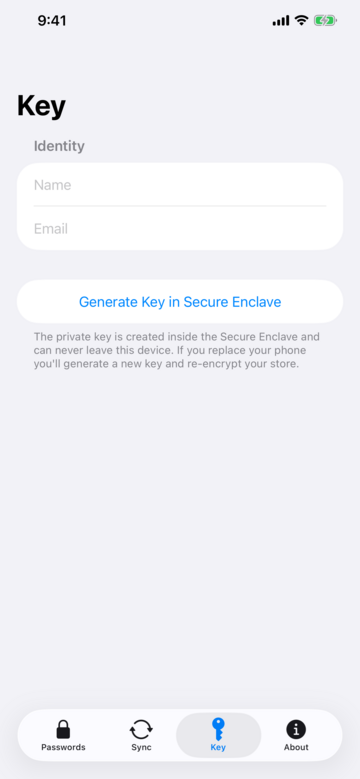
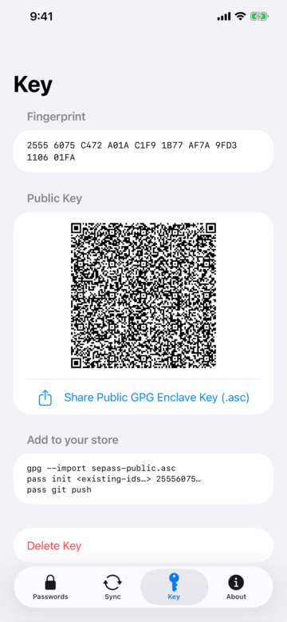
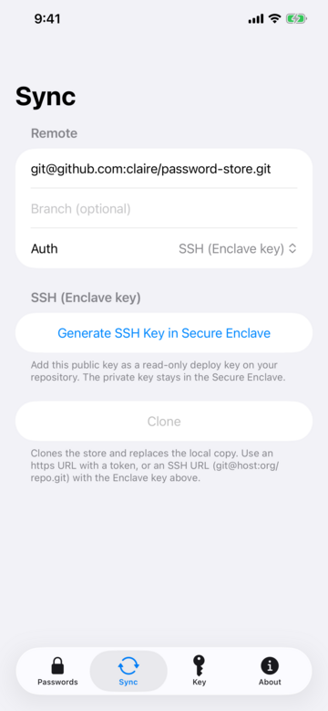
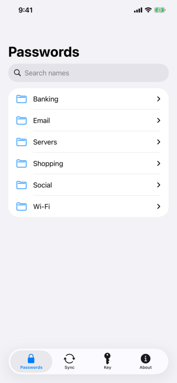
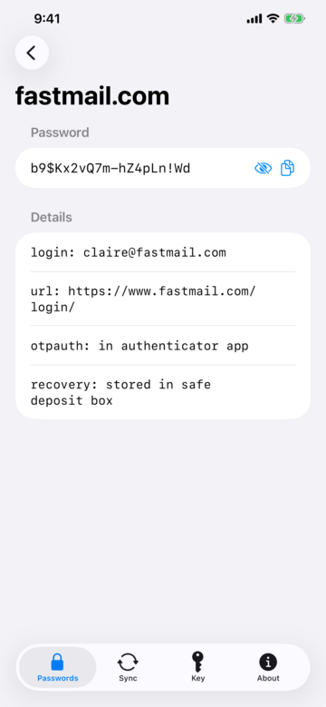

#+TITLE: SE Pass

A minimal iOS app for [[https://www.passwordstore.org/][GNU pass / password-store]] whose private key
lives in the Secure Enclave and *never leaves it*. SE Pass is intended
to allow a user to do three things:

1. *Generate a keypair* in the Secure Enclave and export its OpenPGP public key.
2. *Sync* an encrypted password store over git (clone / pull / push).
3. *Browse* the password tree and *decrypt* entries on demand (biometric-gated).

Unlike a Passkey, there is no backup or export of the secret. A new phone means a
new keypair and a manual re-encrypt of the store. That is the security model, by
design.

* Using the App

** Generate a GPG Key in the Secure Enclave

With the app newly installed on your device, the first thing you
should do is go to the ~Key~ tab, enter a name and email address to
identify a new GPG key with, and then click on
~Generate Key in Secure Enclave~ button :

** Export the Public Key of the Secure Enclave Private Key

You will then have a screen that looks something like this, where the
private GPG decryption key has been generated in the secure enclave:

You can use the share action to get the public (encryption) gpg key
off the device and onto whatever computer you normally run ~pass~ on. 

** Re-Encrypt your password store with the new Key

If you've only ever used pass with a single key, the next step
(re-encrypting your password store with an additional key) can
seem a little daunting. 

Certainly you will want a backup of your password store. Of course you
almost certainly are already making "backups" via git commits and
pushes to wherever you store your passwords. If you are not yet using
the git facility in ~pass~, stop right now and go and set that up
(intsructions [[https://www.passwordstore.org/][here]]).
 
With that all taken care of, you need to import the public key you
exported from your device like this:

 #+begin_src sh
gpg --import sepass-public.asc
#+END_SRC

Depending on you gpg setup, you will probably need to edit the trust
level of this key. You'll need the key's fingerprint (its listed in
the app), and then edit it like this:

#+BEGIN_SRC sh
gpg --edit-key <new-fingerpint>
#+END_SRC

Then type ~trust~ (enter) and select 5, and type ~save~ (enter).

Next, you will need all the fingerprints of your exiting keys used by
~pass~. You can list all GPG keys with:

#+BEGIN_SRC sh
gpg --list-keys
#+END_SRC

Each entry will look something like this (the fingerprint is the second line):

#+BEGIN_SRC sh
pub   rsa4096 2025-10-26 [SC]
      89CA060BE365E505ECA9C99EA0DD3E9C666D3627
uid           [ultimate] Sponge Bob <sponge.bob@bikinibottom.com>
sub   rsa4096 2025-10-26 [E]
#+END_SRC

You'll need to combine all the fingerprints of keys you already use
with the new fingerprint you've added above with a command like:

#+BEGIN_SRC sh
pass init <existing-fingerprint…> <new-fingerprint>   # re-encrypts the store
#+END_SRC

That will re-encrypt your existing password store with all of the
keys, including the new one. If all looks good, you can push the newly
encrypted store to your ~pass~ git repo with:

#+BEGIN_SRC sh
pass git push
#+END_SRC

** Sync the Newly Encrypted Password Store to Your Device

Now you need to clone that new version of the password store to the
~SEPass~ app on your device. The ~Sync~ tab will let you specify a url, an
optional branch name, and a verification method:

If you want to use ssh keys for git authentication, you can generate a
secure enclave ssh key by clicking the ~Generate SSH Key in Secure
Enclave~ button. You'll need to get the public part of that ssh key
into your git repo server. If you're using github.com, instructions
for installing an ssh key are [[https://docs.github.com/en/authentication/connecting-to-github-with-ssh/adding-a-new-ssh-key-to-your-github-account][here]].

Whatever authentication you set up, hit the ~Clone~ button to actually
get the password store transferred to the ~SE Pass~ app.

** Decode a Password

You can then go to the ~Passwords~ tab and navigate your password tree:

and actually decrypt a password:

* How it works

The Secure Enclave only supports NIST P-256 keys. GPG has supported
P-256 ECDH encryption since [[https://www.rfc-editor.org/rfc/rfc6637.html][RFC 6637]], so the =gpg= utility can encrypt
to the phone's key natively. The Enclave performs only the ECDH
key-agreement step of decryption (and the ECDSA self-signatures at key
creation); everything else — OpenPGP packet parsing, the RFC 6637 KDF,
AES key-unwrap, symmetric decryption — is implemented in Swift in
=SEPassCore=. No API path exposes the private key (nor can it, which is
the point of a secure enclave).

What the phone *exports* is a v4 GPG public key — an ECDSA P-256 primary
(certify+sign) plus an ECDH P-256 encryption subkey. (In RFC 4880
terms, this bundle is a "transferable public key": the importable
public-key packets that =gpg --export= produces and =gpg --import=
consumes. "Transferable" describes only the *public* key — the private
part is generated in and never leave the Secure Enclave.)

* Layout

- =Sources/SEPassCore/= — platform-independent OpenPGP + crypto core. No Secure
  Enclave or UIKit dependency, so it is fully unit-tested on macOS and round-tripped
  against a real =gpg=/=pass=. The Enclave operation is injected via the =PGPSigner=
  / =PGPKeyAgreement= protocols.
- =Tests/SEPassCoreTests/= — unit tests, gpg/pass interop tests, and a committed
  hermetic decryption fixture.
- =App/SEPass/= — the SwiftUI app. Secure-Enclave key providers, key management,
  the pass-store model, git seam, and the Key / Sync / Browse screens. A software
  P-256 fallback (=#if targetEnvironment(simulator)=) lets the app run in the
  simulator.
- =App/SEPass.xcodeproj= — the iOS app project (depends on the local =SEPassCore=).

  
* Build & test

#+begin_src sh
# Core library + tests (needs gpg/pass for the interop tests; they skip otherwise).
swift test

# Regenerate the committed decryption fixture (needs gpg):
SEPASS_REGEN=1 swift test --filter FixtureGenTests

# Build the app for the simulator:
xcodebuild build -scheme SEPass -sdk iphonesimulator \
  -destination 'generic/platform=iOS Simulator' CODE_SIGNING_ALLOWED=NO
#+end_src

